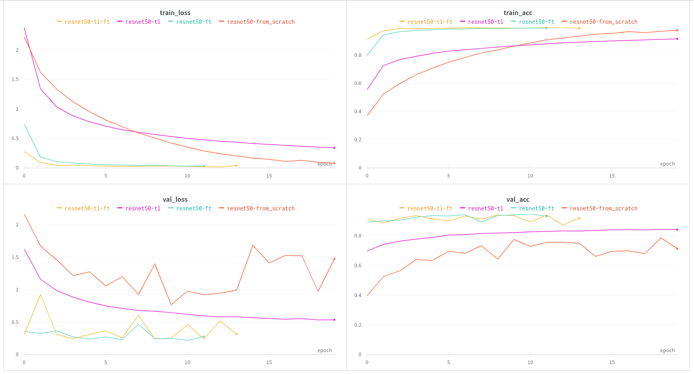

# Open in Google Colab
`resisc_pl_base.ipynb`: 

# Results
Training results of ResNet-50 models for RESISC45 image classification are available as an [interactive Weights & Biases report](https://api.wandb.ai/links/alebojd/36lwd2rl) or in the form of an image below.

- `resnet50-from_scratch` - basic training from randomly-initialized weights
- `resnet50-tl` - training with Imagenet pre-trained weights (freezing all layers except the classifier)
- `resnet50-ft` - training with Imagenet pre-trained weights (all layers unfrozen)
- `resnet50-tl-ft` - continuation of `resnet50-tl` with all layers unfrozen

