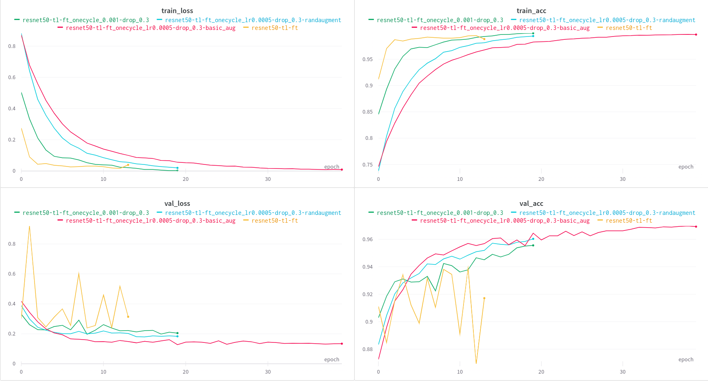

# Open in Google Colab
`resisc_pl_augmentations.ipynb`: 

# Results
Training results with and without data augmentation are availables as an [interactive Weights & Biases report](https://api.wandb.ai/links/alebojd/wm3cnse9) or in the form of an image below.

All below models are finetuned (all layers unfrozen) from transfer learning run (`resnet50-tl` in chapter 05). Trainings 2-4 use OneCycleLR scheduler for training stability and also apply dropout with 0.3 probability.

1. `resnet50-tl-ft` - reference training (from previous chapter) without LR scheduler (**no augmentation**)
2. `resnet50-tl-ft_onecycle_lr0.001-drop_0.3` - reference training (**no augmentation**)
3. `resnet50-tl-ft_onecycle_lr0.0005-drop_0.3-basic_aug` - training with simple `Albumentations` augmentation pipeline defined [here]()
4. `resnet50-tl-ft_onecycle_lr0.0005-drop_0.3-randaugment` - training with `torchvision.RandAugment(num_ops=3)`

We can see that data augmentation improved validation accuracy:
- by ~1.5 percentage points for simple handcrafted pipeline
- by ~0.5 percentage points for RandAugment with 3 operations

compared to reference run (#2).
