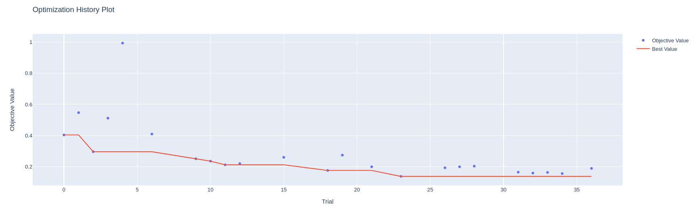
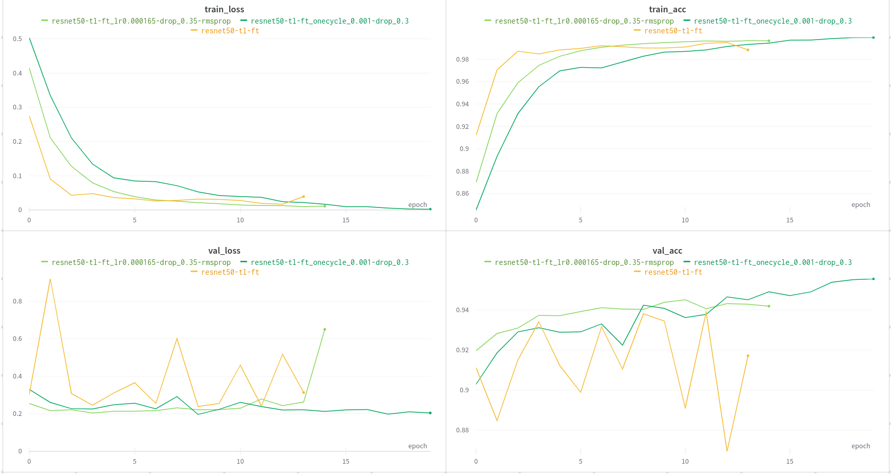

# Open in Google Colab
`resisc_pl_optuna.ipynb`: 

`resisc_optuna_analysis.ipynb`: 

# Results
Configuration dictionary was moved inside `objective` function required by Optuna to easily adapt previous training setup to HPO.
Following parameters were designated for optimization:
- `timm_dropout = trial.suggest_float('dropout', 0.0, 0.7)`
- `lr = trial.suggest_float('lr', 1e-6, 1e-2, log=True)`
- `optimizer = trial.suggest_categorical('optimizer', ['Adam', 'SGD', 'RMSprop'])`

Study was run for 37 trials on 10% of the dataset for faster training. Optimization history is presented on the image below.

The most promising configuration (RMSprop, dropout=0.35, lr=0.000165) was used to train model on the full dataset -- results are presented on the image.

Since we selected only a small subset of parameters for optimization we don't see huge improvement compared to the reference run from chapter 05 (`resnet50-tl-ft`), but the training is definitely more stable. Also, introducing OneCyclerLR scheduler (`resnet50-tl-ft_onecycle_0.001-drop_0.3` from chapter 06) defeats the best Optuna model, since Optuna models haven't used any LR scheduler.

However, the main goal was to explore HPO, and due to the limited GPU access I've decided to run it only on the small subset of hyperparameters, keeping the rest of them fixed. If we wanted to improve on models from the chapter 06 we could add LR schedulers and data augmentations (+ their configuration, as `RandAugment`'s `num_ops`) to the optimization.