# Open in Google Colab
`resisc_pl_explainability.ipynb`: 

# Results
Three interpretability methods from the Captum library were tested. Properly classified and misclassified examples are accumulated in [`ResiscLit`](https://github.com/abojda/deepdrive_course/blob/main/deepdrive_course/resisc45/modules.py#L10)'s `test_step` method. Since we have a sufficiently small dataset we can afford to store all examples in the memory -- for a larger dataset it would be better to process only misclassified samples.

it is especially worth paying attention to incorrectly classified images - we can notice that sometimes they contain objects that actually allow us to classify the image into different categories. Arguably, these aren't model errors, but issues with data selection/labeling or problem formulation -- maybe we should consider reframing a task as a multilabel classification.

## Misclassified images
### Misclassified example #1
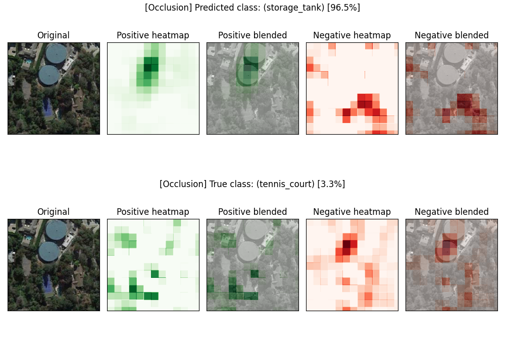
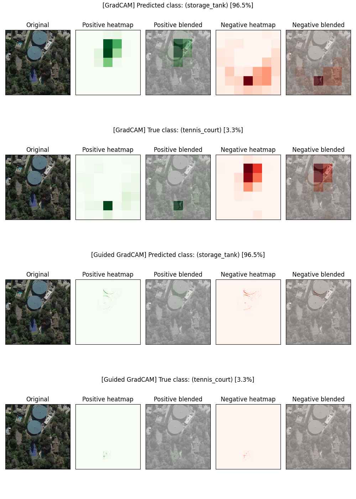

### Misclassified example #2
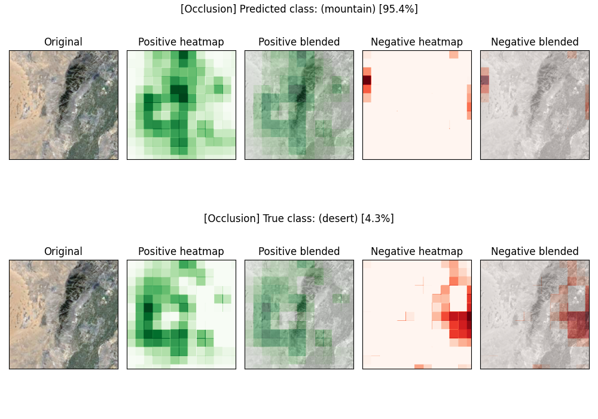
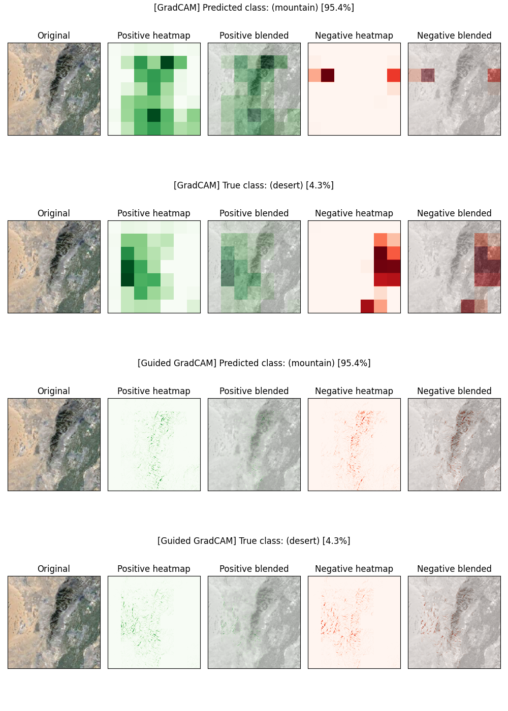

### Misclassified example #3
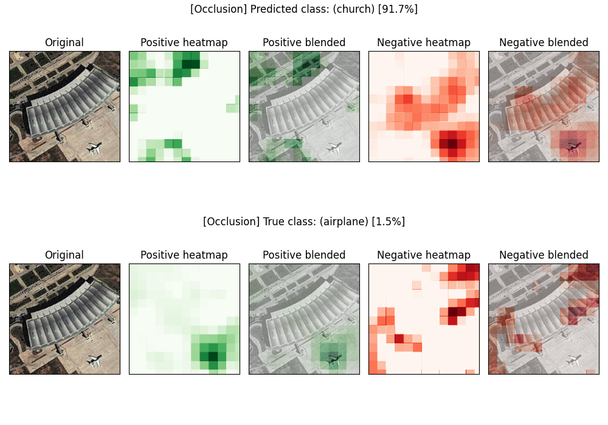
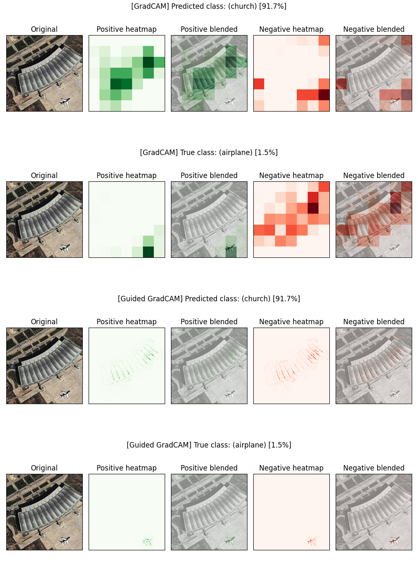

## Propery classified images
### Propery classified example #1
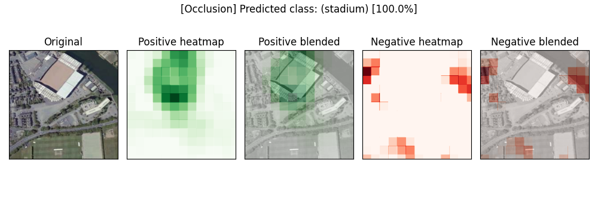
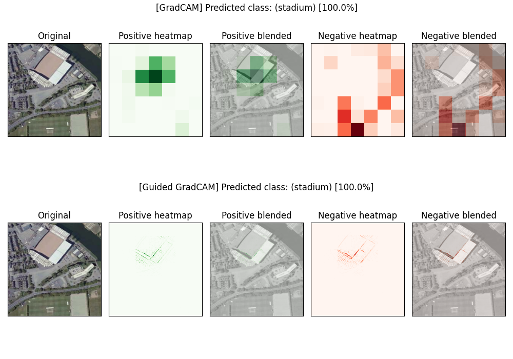

### Propery classified example #2
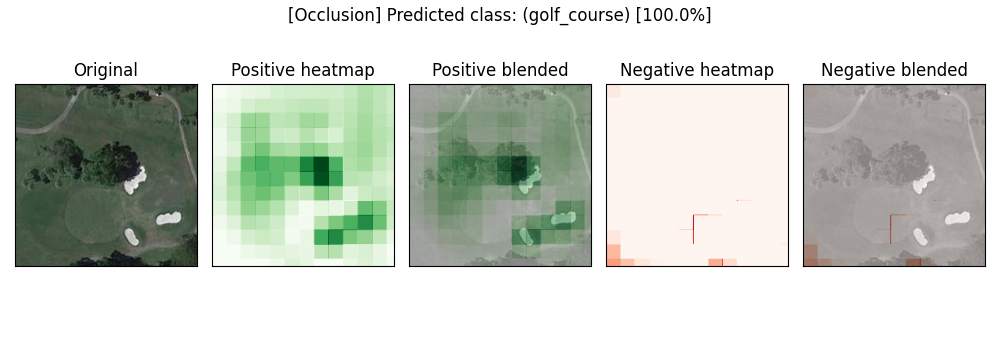
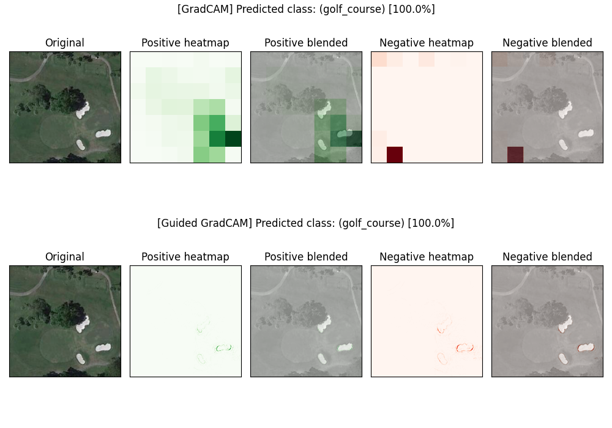

### Propery classified example #3
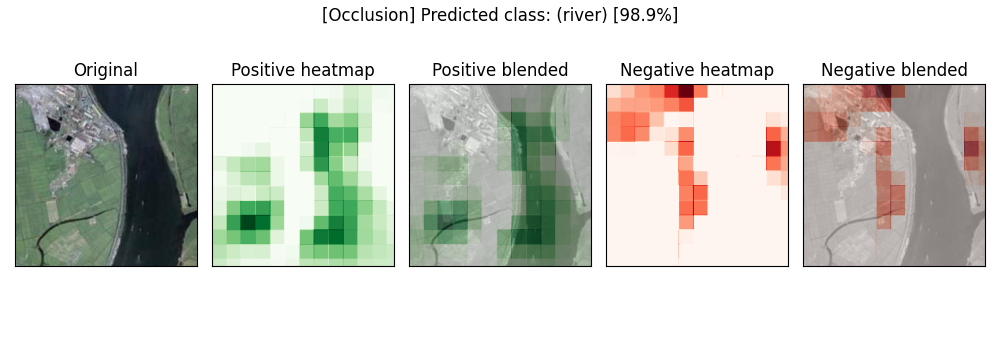
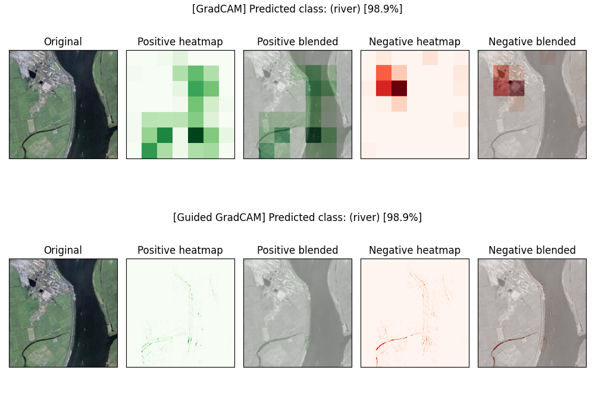
