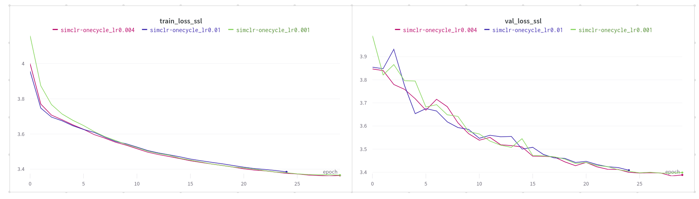
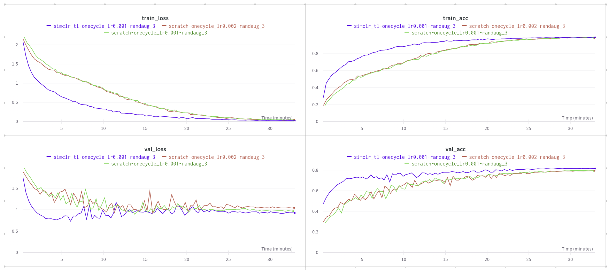

# Open in Google Colab
`stl10_pl_ssl.ipynb`: 

`stl10_pl_supervised.ipynb`: 

# Results
- ResNet50 (with 0.3 dropout) is backbone model used in all the trainings.
- We don't use Imagenet-pretrained backbone model - STL10 dataset contains images from Imagenet, so that would be cheating.
- Supervised learning trainings also used `torchvision.transforms.RandAugment(num_ops=3)` as data augmentation.

## Results of Self-Supervised Learning (SSL) with SimCLR method
- Training on unlabeled part of STL10 dataset (100k images)

## Results of Supervised Learning
- Training on labeled (training split) part of STL10 dataset (5k images)
- Training from scratch vs transfer learning from self-supervised model
- Results also available as an [interactive W&B report](https://api.wandb.ai/links/alebojd/b20hg5z9)

- Training from SSL-pretrained weights converges faster and has better accuracy (by ~2 percentage points) compared to the training from scratch
