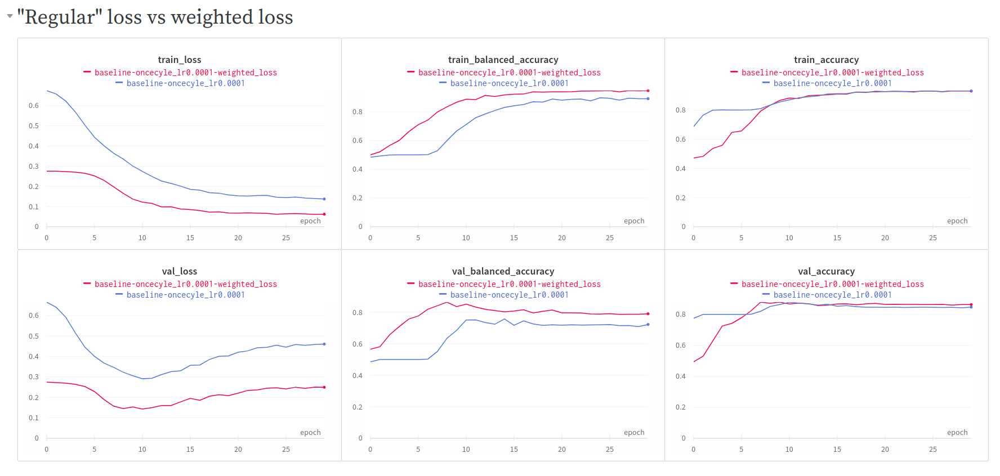

Two "similar" classes from OpenImages dataset were selected to form imbalanced binary classification problem.

Classes:
- `Sink` - 3408 images (~80.1% of the dataset)
- `Bathtub` - 846 images (~19.9% of the dataset)

## Training with "regular" loss vs with weighted loss

We can clearly see that training with weighted loss performs much better. First of all, since we have imbalanced data we should monitor balanced accuracy instead of the "regular" accuracy. Model with weighted loss achieved better balanced accuracy (by ~11 percentage points) compared to the model without weighted loss.
