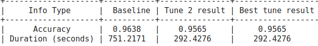

In this part I've decided to perform post training quantization with [neural-compressor](https://github.com/intel/neural-compressor) library.

Quantization was run with `tolerable_loss=0.01` for accuracy criterion. After very short run (2 tune "epochs") this goal was achieved - resulting quantized model achieves almost identical validation accuracy.

Quantized model was almost 4x smaller (~91MB vs ~24MB) as could be expected (`FP32` => `INT8`) 

Since int8 quantization is designed e.g. for mobile devices and not for GPUs, there is no point in running inference time benchmarks.
