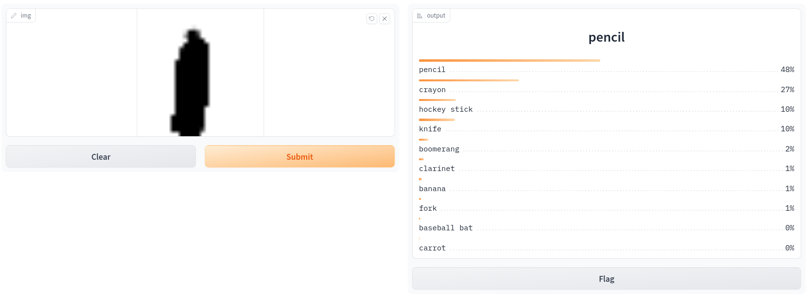

# Run locally

#### 1. Install Gradio

```bash
pip install gradio
```

#### 2. Run

```bash
cd demo
gradio quickdraw_gradio_demo.py
```

Demo is available on [localhost:7860](http://localhost:7860/)


